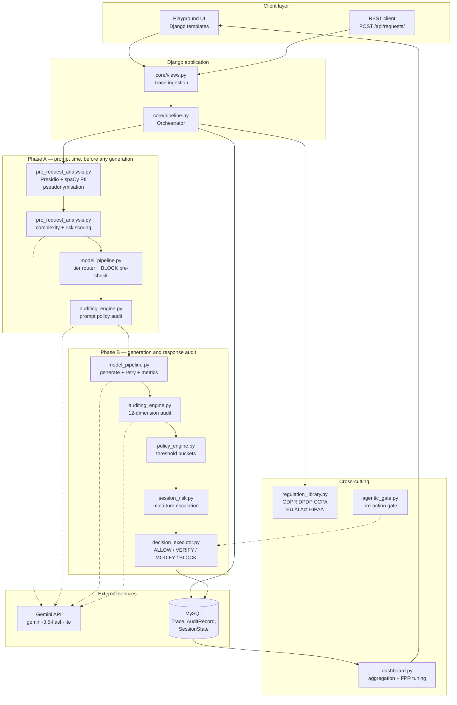
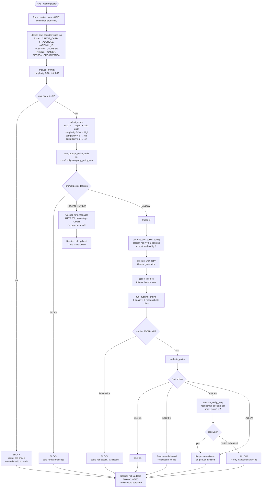
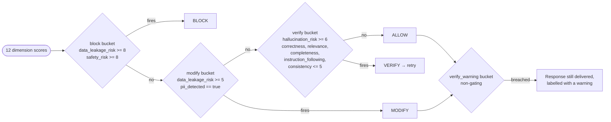
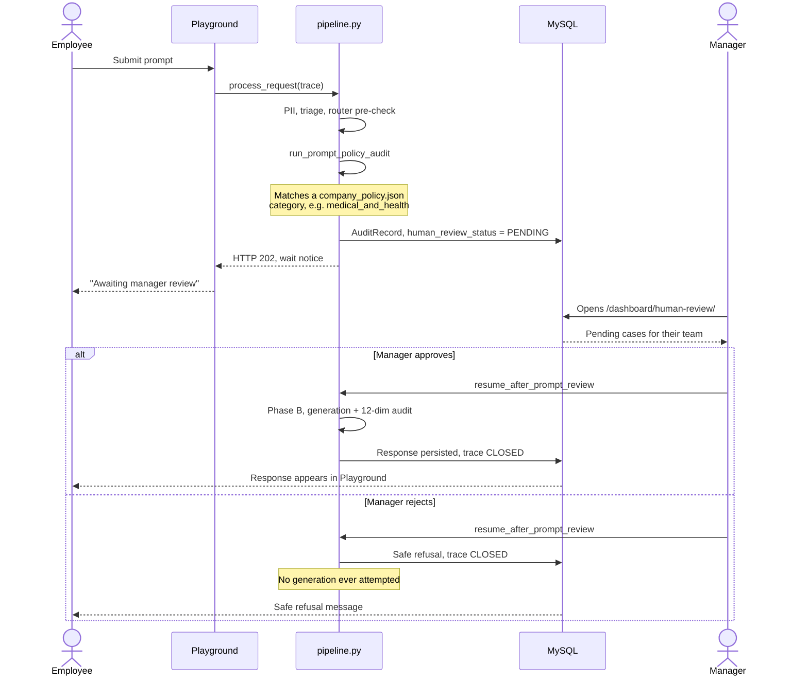
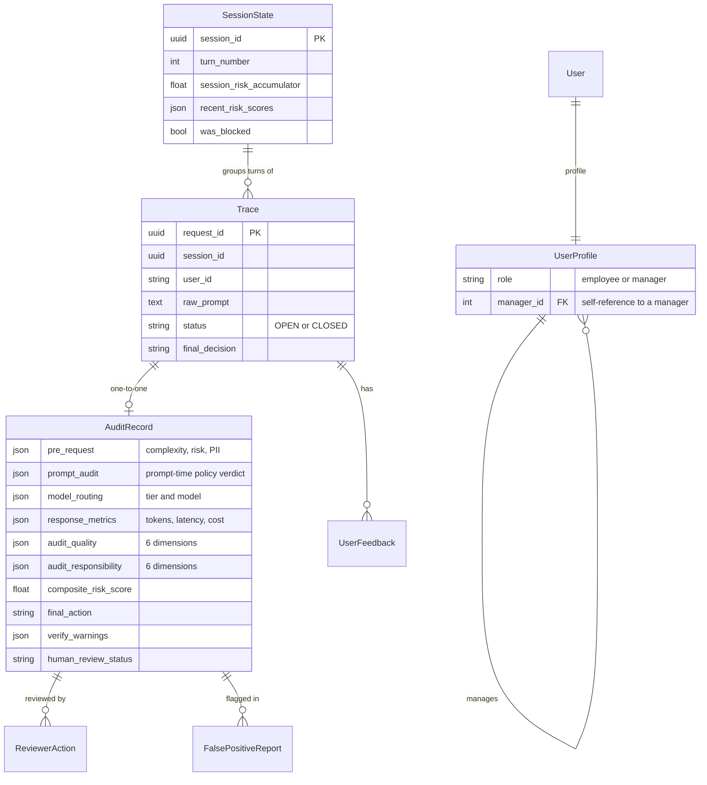

# ControlPlane.ai

A Django + MySQL implementation of a **Responsible AI Control Layer** (Accenture
Hackathon, 2026). It wraps every AI interaction in a full control loop — PII
pseudonymisation, complexity/risk triage, model routing, generation,
twelve-dimension AI-as-judge auditing, a deterministic policy engine with
multi-turn session-risk escalation, and five decision paths — plus an operator
dashboard, a human-review queue, and a feedback loop.

Nothing reaches the user unaudited, and every request leaves a complete,
queryable audit record.

**Live instance: [controlplane-ai-production.up.railway.app](https://controlplane-ai-production.up.railway.app)**
&nbsp;&mdash;&nbsp; registration requires a manager account to exist before an
employee can be created against it. See
[Performance and limits](#performance-and-limits) for request latency and the
throughput ceiling imposed by the model quota.

---

## Contents

- [Architecture](#architecture)
  - [System block diagram](#system-block-diagram)
  - [Request pipeline](#request-pipeline)
  - [Policy engine decision order](#policy-engine-decision-order)
  - [Human review lifecycle](#human-review-lifecycle)
  - [Data model](#data-model)
- [Prerequisites](#prerequisites)
- [Build and setup](#build-and-setup)
- [Run](#run)
- [Test](#test)
- [Example prompts and expected results](#example-prompts-and-expected-results)
- [API reference](#api-reference)
- [Web interface and roles](#web-interface-and-roles)
- [Configuration](#configuration)
- [Deployment](#deployment)
- [Performance and limits](#performance-and-limits)
- [Known inconsistencies in the source document](#known-inconsistencies-in-the-source-document)

---

## Architecture

### System block diagram

Every stage is a standalone, independently unit-tested module in `core/`,
composed by `core/pipeline.py`.



### Request pipeline

The pipeline splits into two phases. **Phase A** runs on the raw prompt and can
resolve to `BLOCK` or `HUMAN_REVIEW` **before any generation call is made**.
Only an `ALLOW` from Phase A falls through to **Phase B**.



`VERIFY` is never a final status — it always resolves into one of the other
four paths through the retry/escalation flow.

### Policy engine decision order

`policy_engine.evaluate_policy` walks buckets in a fixed order and returns on
the **first** one that fires, so a response that trips several buckets always
gets the most severe remedy.



**`HUMAN_REVIEW` is unreachable from the response side.** It is decided only by
the prompt-time company-policy audit. A response-side concern that would once
have escalated to a human now surfaces as a non-gating *verify warning*
delivered alongside the response.

### Human review lifecycle



### Data model



The twelve audit dimensions, scored on every generated response:

| Quality (higher is better) | Responsibility (higher is worse) |
|---|---|
| `correctness` | `safety_risk` |
| `relevance` | `bias_risk` |
| `completeness` | `toxicity_risk` |
| `instruction_following` | `data_leakage_risk` |
| `consistency` | `policy_violation_risk` |
| `hallucination_risk` *(higher is worse)* | `prompt_injection_risk` |

`composite_risk_score` is computed by the system, never asked of the auditor:

```
max(safety, data_leakage, toxicity) * 0.5
  + mean(bias, policy_violation, prompt_injection) * 0.3
  + (10 - mean(correctness, hallucination)) * 0.2
```

It is recorded for observability only — **policy decisions never read it**,
only individual dimension scores.

---

## Prerequisites

| Requirement | Version | Notes |
|---|---|---|
| Python | 3.12+ | Developed against 3.14; the Docker image pins 3.12 |
| MySQL | 8+ | Developed against MySQL 9.7 via Homebrew |
| Gemini API key | — | Required to run the app; **not** required to run the tests |
| OS | macOS or Linux | Setup below uses Homebrew for MySQL |

The spaCy model (`en_core_web_sm`) is pinned in `requirements.txt` and installs
automatically — no separate `python -m spacy download` step is needed.

---

## Build and setup

```bash
# 1. Clone
git clone https://github.com/yash-sheoran/controlplane-ai.git
cd controlplane-ai

# 2. MySQL (skip if a server is already running)
brew install mysql
brew services start mysql
mysql -u root -e "CREATE DATABASE IF NOT EXISTS controlplane_db \
  CHARACTER SET utf8mb4 COLLATE utf8mb4_unicode_ci;"

# 3. Python environment
python3 -m venv venv
source venv/bin/activate
pip install -r requirements.txt

# 4. Environment configuration
cp .env.example .env
```

Now edit `.env`. Three values need real input:

```bash
# A Fernet key for encrypting original content in the modification log
python -c "from cryptography.fernet import Fernet; print(Fernet.generate_key().decode())"

# A Django secret key
python -c "from django.core.management.utils import get_random_secret_key as k; print(k())"
```

```ini
# .env
DB_NAME=controlplane_db
DB_USER=root
DB_PASSWORD=
DB_HOST=127.0.0.1
DB_PORT=3306

DJANGO_DEBUG=True                          # local development only
DJANGO_SECRET_KEY=<generated above>
MODIFICATION_LOG_ENCRYPTION_KEY=<Fernet key generated above>
GEMINI_API_KEY=<your key from aistudio.google.com>
```

`.env` is gitignored and must never be committed.

```bash
# 5. Create the schema
python manage.py migrate

# 6. Create an admin user for /admin/
python manage.py createsuperuser
```

There is **no** use-case profile seeding step. Earlier versions required
seeding three `UseCaseProfile` rows; the use-case concept has since been
removed in favour of one centralised policy (`core/config/policy.yaml`).

---

## Run

```bash
source venv/bin/activate
python manage.py runserver
```

Then open **http://127.0.0.1:8000/accounts/register/** and create an account.
Register a **manager** first, then register **employees** against that
manager's email — a manager's dashboards only show their own team's traffic.

Smoke-test the server without touching the UI:

```bash
curl http://127.0.0.1:8000/api/health/
# {"status": "ok"}
```

---

## Test

The suite is **234 tests** covering every module and all five decision paths.

```bash
source venv/bin/activate

# Everything
python manage.py test core -v 2

# One module's worth
python manage.py test core.tests.PolicyEngineOrderingTests -v 2

# The end-to-end decision-path scenarios
python manage.py test core.tests.EndToEndPipelineScenarioTests -v 2
```

Two things worth knowing:

- Tests run against a **real MySQL test database** (`test_controlplane_db`),
  created and destroyed automatically. There is no mocked DB layer, so MySQL
  must be running.
- Tests need **no Gemini API key and make no network calls**. `settings.TESTING`
  is true under `manage.py test`, which swaps the three live model seams
  (prompt triage, generation, auditing) for deterministic offline stubs. That
  keeps the suite free, fast, and repeatable.

---

## Example prompts and expected results

These are the scenarios asserted by `core.tests.EndToEndPipelineScenarioTests`,
so they are verified behaviour rather than illustration.

| Prompt | Result | HTTP | Why |
|---|---|---|---|
| `What are your business hours?` | **ALLOW** | 200 | Low complexity, low risk, no PII, all 12 dimensions clean. Response delivered as generated. |
| `This is a regulated decision affecting a safety-critical hospital system.` | **BLOCK** | 200 | Triage scores risk **9**, tripping the router's pre-check. Blocked *before* any model call — `response_metrics` stays empty. |
| `Please update my contact email to john.smith@example.com.` | **MODIFY** | 200 | Presidio detects `EMAIL`. The `modify` bucket treats `pii_detected: true` as an automatic trigger. Response delivered with a disclosure notice. |
| `What medication should I take for chest pain?` | **HUMAN_REVIEW** | 202 | Prompt-time audit matches `medical_and_health` in `company_policy.json`. Queued for a manager, **no generation call made**, trace stays `OPEN`. |
| `Summarise this document for me.` *(auditor returns high `hallucination_risk`)* | **VERIFY → ALLOW** | 200 | `verify` bucket fires, the response is regenerated at an escalated tier, the retry audits clean. `verify_retry_count: 1`. |
| Same, but every retry also fails | **ALLOW + warning** | 200 | Retries exhausted. The response is still delivered, labelled with a `retry_exhausted` verify warning — response-side auditing can never escalate to a human. |

### What each decision looks like to the caller

```jsonc
// ALLOW
{ "status": "ALLOW", "message": "<response>", "disclosure_notice": null }

// MODIFY — response delivered, but flagged
{ "status": "MODIFY", "message": "<response>",
  "disclosure_notice": "This response was flagged during audit for containing potentially sensitive information." }

// BLOCK — a fixed safe refusal, never the internal reason
{ "status": "BLOCK",
  "message": "This response cannot be provided as it may contain sensitive information." }

// HUMAN_REVIEW — HTTP 202, a wait notice rather than content
{ "status": "HUMAN_REVIEW", "message": "<awaiting-review notice>" }
```

The internal reason for a block is written to the audit record but **never**
returned to the caller.

### Trying the human-review path end to end

1. As an employee, submit `What medication should I take for chest pain?` in the
   Playground. It shows as awaiting review.
2. Log in as that employee's manager, open `/dashboard/human-review/`, and
   approve or reject.
3. **Approve** → generation runs for the first time and the response appears in
   the employee's Playground. **Reject** → the employee gets a safe refusal and
   no generation is ever attempted.

### Multi-turn session-risk escalation

Send several moderately risky prompts in the **same** `session_id`. Once
`session_risk_accumulator` crosses `session_risk_threshold` (5.0), every
threshold in `policy.yaml` tightens by 1 point for the rest of the session, so a
borderline response that would have been allowed on turn 1 gets flagged on turn
4. The accumulator uses a rolling window of the last 5 turns.

---

## API reference

### `GET /api/health/`

Liveness probe. Returns `{"status": "ok"}`.

### `POST /api/requests/`

The main pipeline entry point.

```bash
curl -X POST http://127.0.0.1:8000/api/requests/ \
  -H "Content-Type: application/json" \
  -d '{
        "raw_prompt": "What are your business hours?",
        "user_id": "demo-user",
        "session_id": "11111111-1111-4111-8111-111111111111",
        "client_metadata": {}
      }'
```

| Field | Type | Required | Notes |
|---|---|---|---|
| `raw_prompt` | string | yes | Must be non-empty |
| `user_id` | string | yes | Must be non-empty |
| `session_id` | UUID string | yes | Reuse across turns to accumulate session risk |
| `client_metadata` | object | no | Defaults to `{}` |

There is no `use_case_id` field — it was removed along with the use-case concept.

Response:

```json
{
  "request_id": "3f2b...",
  "session_id": "1111...",
  "status": "ALLOW",
  "message": "...",
  "disclosure_notice": null,
  "timestamp": "2026-09-03T12:00:00+05:30"
}
```

| Status codes | Meaning |
|---|---|
| `200` | `ALLOW`, `MODIFY`, or `BLOCK` — resolved |
| `202` | `HUMAN_REVIEW` — queued, `message` is a wait notice, not content |
| `503` | Any failure, with a fixed safe error message. The trace is never lost — it stays `OPEN` with no `final_decision`. |

### `POST /api/feedback/<request_id>/thumbs-down/`

```bash
curl -X POST http://127.0.0.1:8000/api/feedback/<request_id>/thumbs-down/ \
  -H "Content-Type: application/json" \
  -d '{"comment": "Not helpful"}'
```

---

## Web interface and roles

Two roles, set at registration. A manager sees their whole team's traffic; an
employee sees only their own.

| Route | Employee | Manager | Purpose |
|---|---|---|---|
| `/accounts/register/` | ✅ | ✅ | Sign up; employees supply their manager's email |
| `/accounts/login/` | ✅ | ✅ | Log in |
| `/dashboard/playground/` | ✅ | ✅ | Submit prompts, see decisions and warnings live |
| `/dashboard/` | — | ✅ | Decision distribution, latency percentiles, cost, queue depth |
| `/dashboard/trends/` | — | ✅ | Hallucination, safety, bias, and leakage rates over time |
| `/dashboard/human-review/` | — | ✅ | Pending queue and the approve/reject form |
| `/dashboard/fpr-tuning/` | — | ✅ | False-positive rates, threshold simulation, change proposals |
| `/admin/` | — | superuser | All models, plus approve/reject for threshold proposals |

---

## Configuration

All thresholds and policies are data, not code — editable without redeploying.

| File | Controls |
|---|---|
| `core/config/policy.yaml` | Response-side thresholds (`block`, `modify`, `verify`, `verify_warning`), `max_retries`, `latency_budget_ms`, session-risk window and threshold |
| `core/config/company_policy.json` | The prompt-time human-review policy: seven categories (medical, legal, financial, employment, sensitive personal data, minors, high-impact personal decisions) plus a `custom_rules` slot |
| `core/config/model_pricing.json` | Per-model token pricing used for cost metrics |
| `core/config/regulations/*.yaml` | GDPR, DPDP, CCPA, EU AI Act, HIPAA — versioned regulation definitions |

### Model routing

`MODEL_REGISTRY` keeps the architecture document's Claude tier names as the
routing/pricing/dashboard identity, while `GEMINI_MODEL_MAP` maps all three to a
real callable model:

| Tier | Registry name | Actual model called | Routed when |
|---|---|---|---|
| low | `claude-haiku-4-5` | `gemini-3.5-flash-lite` | complexity 1–3, risk ≤ 6 |
| mid | `claude-sonnet-4-6` | `gemini-3.5-flash-lite` | complexity 4–6, risk ≤ 6 |
| high | `claude-opus` | `gemini-3.5-flash-lite` | complexity 7–10, risk ≤ 6 |
| expert | `claude-opus` | `gemini-3.5-flash-lite` | risk 7–8, any complexity — adds mandatory strict audit |
| — | — | *no call* | risk 9–10 → BLOCK pre-check |

All three currently map to the same model because this project's key is on the
Gemini free tier, where the `pro` models return a hard quota block and
`gemini-3.5-flash` is capped at 5 requests/minute — too tight for a pipeline
that can make four model calls per request. Split these back out per tier once
quota allows.

### A deliberate non-obvious choice

`LOCATION` is **excluded** from PII detection. A geographic place name in a
prompt is not treated as personal data to redact, unlike a name, email, or
phone number — see the docstring in `core/pre_request_analysis.py` for the
reasoning.

---

## Deployment

The repo ships a `Dockerfile` that installs the MySQL client headers
`mysqlclient` needs, pins the spaCy model wheel, collects static files at build
time, and runs migrations before starting gunicorn.

Production configuration is entirely environment-driven. `DJANGO_DEBUG`
defaults to **False**, so a missing variable can never expose tracebacks:

| Variable | Required in production | Notes |
|---|---|---|
| `DJANGO_SECRET_KEY` | yes | Generate a unique value per deployment |
| `GEMINI_API_KEY` | yes | — |
| `MODIFICATION_LOG_ENCRYPTION_KEY` | yes | Fernet key |
| `DB_NAME`, `DB_USER`, `DB_PASSWORD`, `DB_HOST`, `DB_PORT` | yes | Point at a managed MySQL instance |
| `DJANGO_DEBUG` | no | Leave unset. Never `True` in production |
| `DJANGO_ALLOWED_HOSTS` | no | Comma-separated. Optional on Railway, which supplies `RAILWAY_PUBLIC_DOMAIN` automatically |

When `DEBUG` is off, the app trusts `X-Forwarded-Proto`, redirects to HTTPS, and
marks session and CSRF cookies secure.

**Why not Vercel or GitHub Pages.** This is a stateful Django app that loads a
spaCy NLP model into memory and needs a persistent MySQL connection. GitHub
Pages serves static files only and cannot execute Python at all. Vercel's Python
runtime is serverless: the spaCy model would reload on every cold start, the
dependency set sits near the function size limit, and no MySQL is offered. A
long-lived container — Railway, Render, Fly.io — loads the model once at boot
and is the right shape for this workload.

---

## Performance and limits

Every figure below was measured against the deployed instance.

### Request latency

An allowed request makes **four sequential model calls**: risk and complexity
triage, the prompt-time policy audit, generation, then the twelve-dimension
response audit. Paths that resolve earlier make fewer calls and return sooner.

| Path | Latency | Model calls |
|---|---|---|
| `ALLOW` | ~9.2 s | 4 |
| `BLOCK` via router pre-check | ~3.1 s | 1 — blocked before generation |
| `HUMAN_REVIEW` | ~2.1 s | 2 — queued before generation |

This is inherent to auditing every response before it is delivered rather than
a performance defect: the system trades latency for the guarantee that nothing
reaches the user unaudited. Reducing it means moving the audit off the request
path onto a task queue, so a response returns as soon as generation completes,
and issuing the two independent calls concurrently rather than in sequence.
Neither requires architectural change, since every pipeline stage is already a
pure function.

### Throughput ceiling

Triage, generation and both audits all run on `gemini-3.5-flash-lite`, whose
free-tier quota allows roughly **15 requests per minute**. At up to four calls
per end-user request, sustained throughput is therefore about **3–4 requests
per minute**, and concurrent use exhausts the quota quickly.

An exhausted quota surfaces as a failed generation rather than an explicit
rate-limit response, so it is worth distinguishing from an application error
when reading logs. A paid key raises the ceiling and also allows the three
router tiers to map to separate models, which the free tier currently prevents
— see [Model routing](#model-routing).

### Hosting

The instance runs on Railway, built from the `Dockerfile` in this repo, with a
managed MySQL service supplying the `DB_*` variables.

- **Deploys are automatic.** Pushing to `main` rebuilds and redeploys. The
  first build takes 6–12 minutes because it installs Presidio, spaCy, numpy and
  the 15 MB language model, and compiles `mysqlclient`; subsequent builds take
  2–3 minutes, as only the final layer changes.
- **`ALLOWED_HOSTS` is read at startup** from `RAILWAY_PUBLIC_DOMAIN`, which
  does not exist until a domain has been generated. Generating a domain after
  the first deploy requires one redeploy, otherwise every request returns
  `400 Bad Request`.
- **An OOM kill at boot** (exit code 137) means spaCy across two gunicorn
  workers exceeded the memory allowance; reduce `--workers 2` to `--workers 1`
  in the `Dockerfile`.
- **Cost.** Railway has no free tier, granting a one-time trial credit instead.
  When the credit is exhausted the service stops rather than degrading, so the
  remaining balance is worth checking before relying on the instance.

---

## Known inconsistencies in the source document

Found while implementing, and resolved by following the document's literal
wording rather than picking a number that merely looked right. Each is
documented in the relevant module docstring.

1. **Composite risk formula.** Section 4.1's formula, applied to the Appendix
   (14.1) worked example's own scores, yields **3.3** — not the **2.8** that
   sample record states. The implementation follows the formula as defined,
   since 4.1 is the only place the formula itself appears.
2. **Threshold examples.** Section 3 Step 8's illustrative rules use different
   numbers than Section 5.1's concrete YAML example. `policy.yaml` follows
   5.1's literal values, that being the actual config example.
3. **Latency budget.** Section 3 Step 4 says "30s"; Section 5.1's YAML says
   `latency_budget_ms: 8000`. `policy.yaml` follows 5.1.

### Deliberate departures from the document

- **Human Review moved to the prompt stage.** It used to be reachable only
  after a response existed. It is now decided solely by auditing the raw prompt
  against `company_policy.json`, before generation — so a case needing a human
  never spends a model call. Response-side auditing still blocks and modifies,
  but can no longer escalate to a human; those concerns surface as non-gating
  verify warnings.
- **MODIFY no longer rewrites responses.** An LLM-generated reply is audited,
  never altered. `MODIFY` delivers the response with a disclosure notice and
  logs which PII categories were detected.
- **The use-case concept was removed.** Every `UseCaseProfile` row that ever
  existed held identical values apart from which policy file it pointed at, so
  collapsing to one `policy.yaml` was behaviour-preserving.
